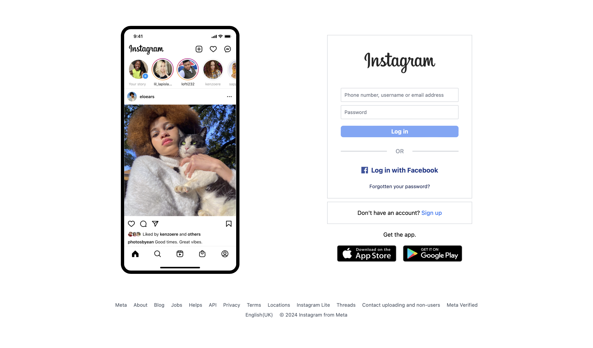

# Project Title

A brief description of your project.

## Installation

Instructions on how to install or deploy your website.

## Usage

Guidelines on how users can interact with your website.

## Configuration

Information on how to configure any settings required by your website.

## Contributing

Guidelines for contributing to your project.

## License

Specify the license under which your website is distributed.

## Credits

Acknowledge any third-party libraries, frameworks, or resources used in your project.

## Contact

Provide contact information for users to reach out with questions or feedback.

## Additional Information

Include any additional information that might be relevant to users.

## Screenshots

